# Roomie App

## 🏠 Overview

Roomie is a comprehensive platform designed to simplify the process of finding roommates and shared accommodations. Whether you're a student, a working professional, or someone relocating to a new city, Roomie connects you with compatible housemates and available rooms, making shared living convenient and stress-free.

---

## 📱 Features

### For Roommates

* **Profile Creation**: Build a detailed profile with personal information, preferences, and lifestyle habits.

* **Matchmaking System**: Utilize a Tinder-style swipe feature to find potential roommates based on shared interests, habits, and preferences.

* **Search Filters**: Apply filters such as location, budget, smoking habits, pet preferences, and more to find the ideal match.

* **Real-Time Chat**: Engage in secure, in-app messaging to communicate with potential roommates.

* **Availability Calendar**: View and manage availability to coordinate move-in dates.

### For Landlords

* **Room Listing**: Easily list available rooms with detailed descriptions, photos, and rental terms.

* **Tenant Matching**: Receive recommendations for potential tenants based on compatibility scores.

* **Application Management**: Review applications, schedule interviews, and finalize agreements through the platform.

* **Payment Integration**: Set up secure payment methods for rent collection and deposits.

---

## User Flow

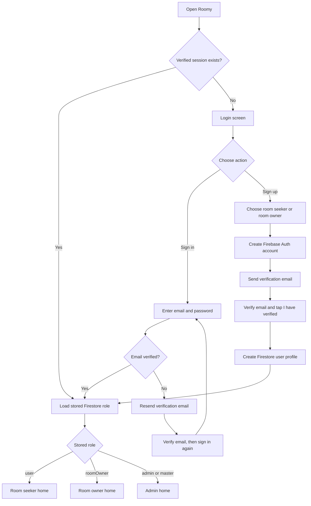

Admin and master accounts are not self-service signup options; provision them through a trusted process and assign the required Firebase Auth admin claim.

---

## 🛠️ Tech Stack

* **Frontend**: Flutter – for building natively compiled applications for mobile, web, and desktop from a single codebase.

* **Backend**: Firebase – for real-time database, authentication, and storage solutions.

* **Maps Integration**: Google Maps API – to display room locations and nearby amenities.

* **Authentication**: Firebase Authentication – for secure sign-in and user management.

* **Storage**: Firebase Storage – to upload and manage images and documents.

* **Push Notifications**: Firebase Cloud Messaging – to send notifications about new matches and messages.

---

## 🚀 Getting Started

### Prerequisites

* Flutter SDK providing Dart 3.7.2 or newer

* Firebase account with Firestore and Firebase Storage enabled

* Google Maps API key

### Installation

1. Clone the repository:

   ```bash
   git clone https://github.com/SuyashS05/roomy.git
   cd roomy
   ```

2. Install dependencies:

   ```bash
   flutter pub get
   ```

3. Set up Firebase:

   * Create a Firebase project at [https://console.firebase.google.com/](https://console.firebase.google.com/).

   * Add your app to the Firebase project.

   * Download the `google-services.json` (for Android) or `GoogleService-Info.plist` (for iOS) and place it in the appropriate directory.

4. Configure Google Maps API:

   * Enable the Maps SDK for Android in Google Cloud and restrict its key to this Android package and signing certificate.

   * Set `MAPS_API_KEY` in your shell or CI secret store, or add `MAPS_API_KEY=your-key` to the ignored `android/local.properties` file.

   * For PowerShell, set `$env:MAPS_API_KEY = "your-key"` before running `flutter run`.

   * Maps keys are included in the built app and cannot be kept secret there. Restrict the key to the required API and app identity, and rotate any key that was committed or exposed. Firebase client API keys are also public configuration; protect Firebase data with Security Rules and App Check rather than treating those keys as secrets.

5. Run the app:

   ```bash
   flutter run
   ```

---

## 📸 Screenshots

<div align="center">
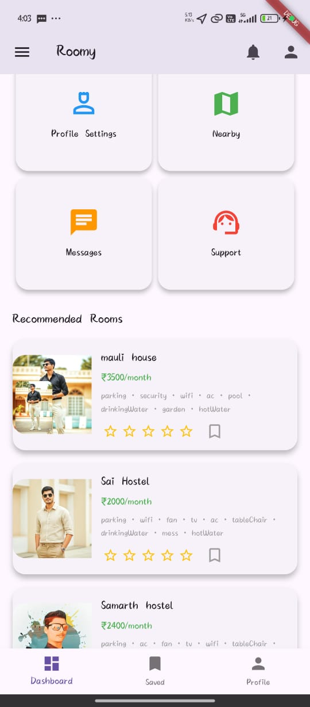
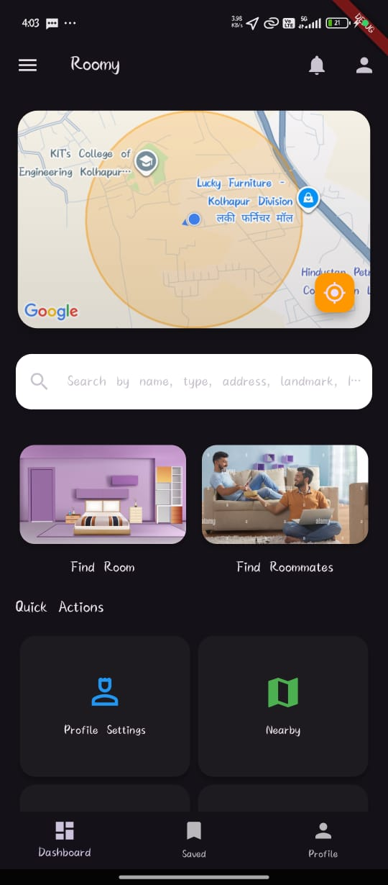
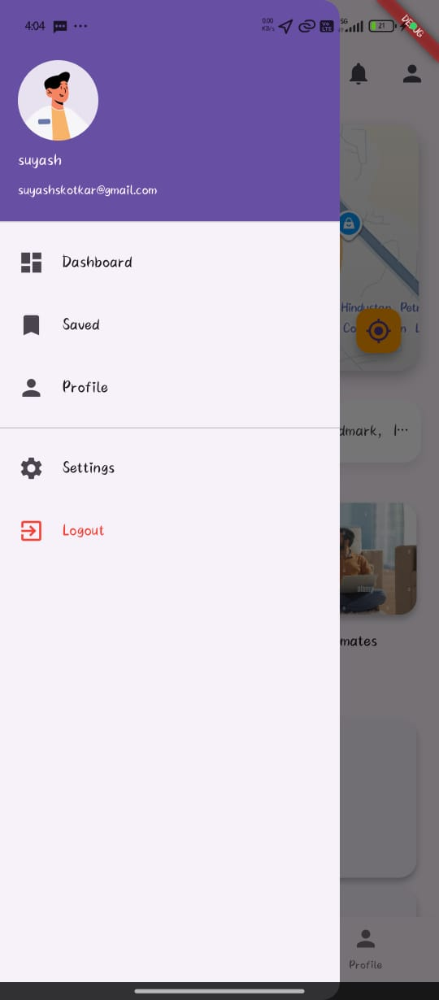
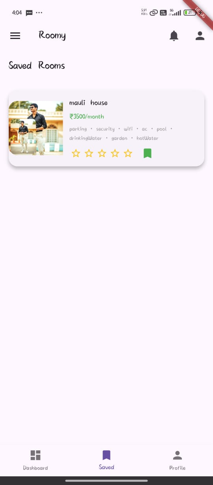
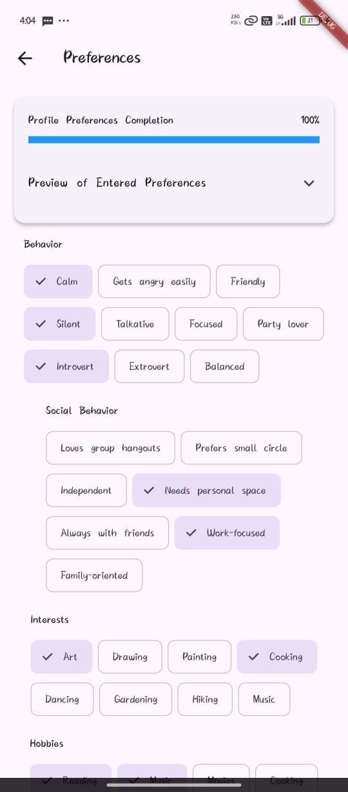
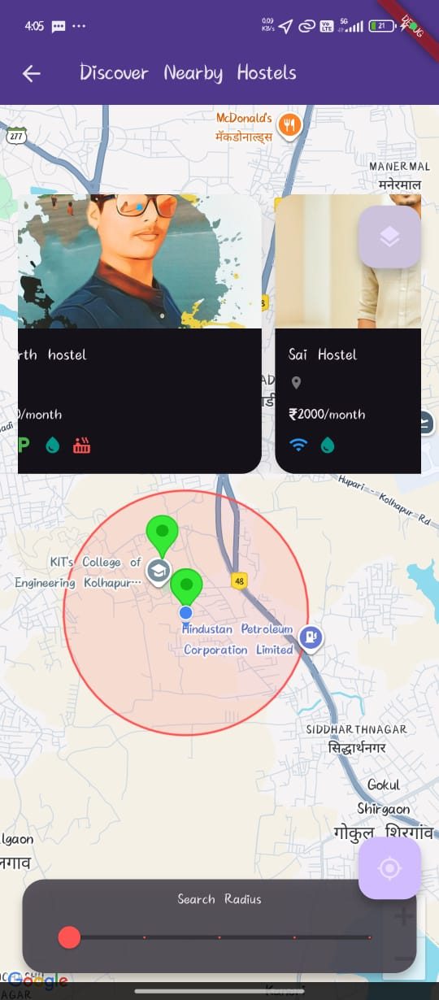
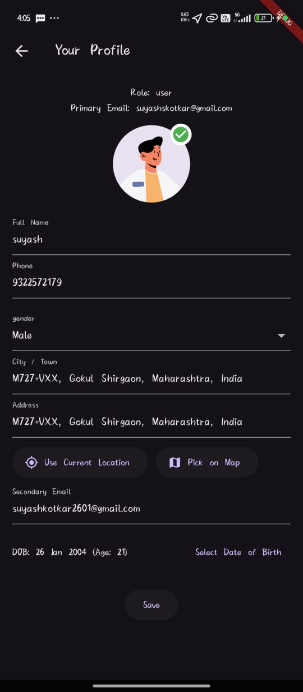
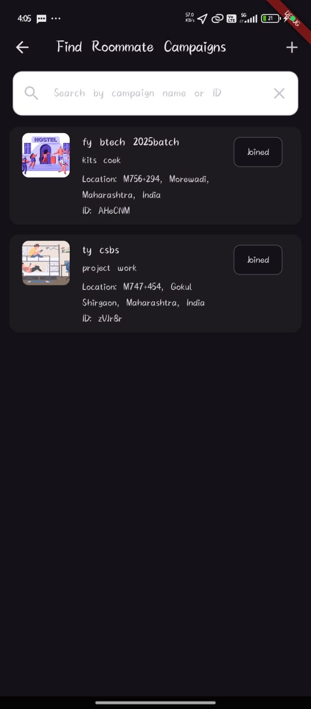
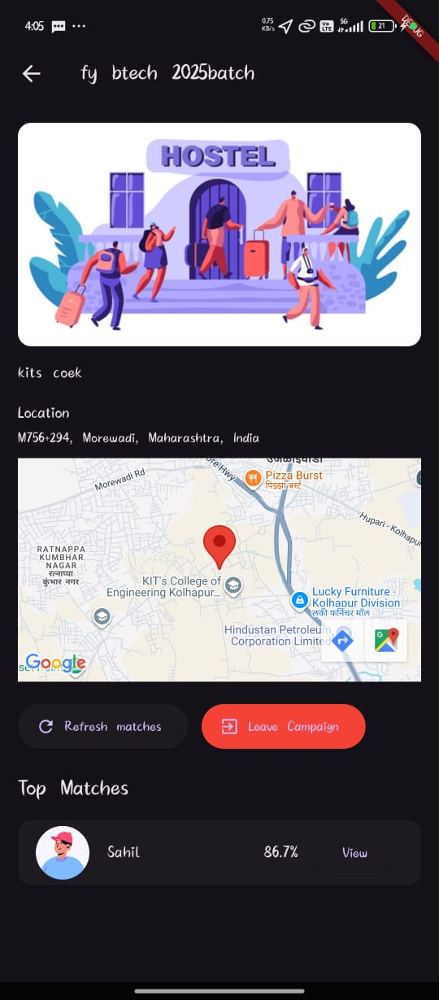
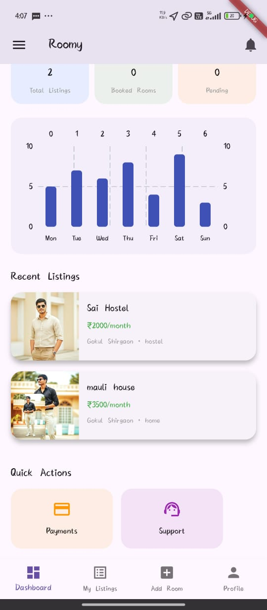
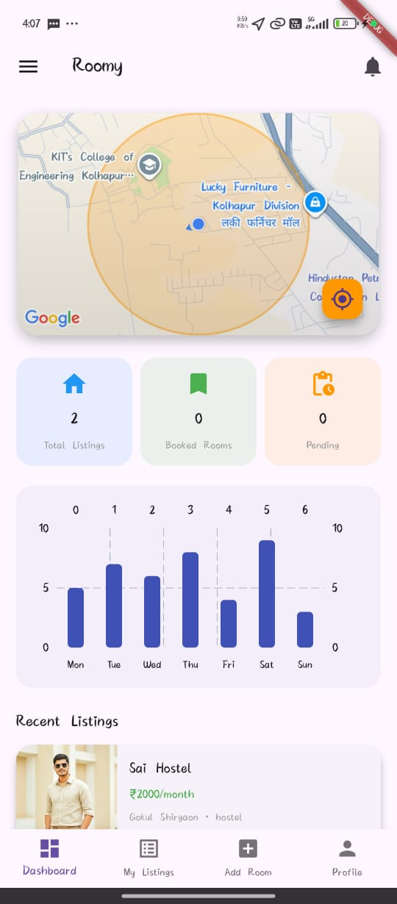
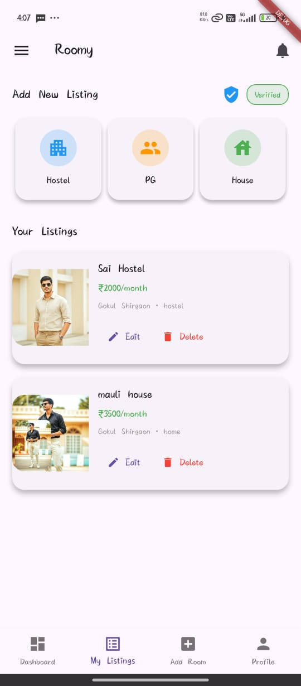
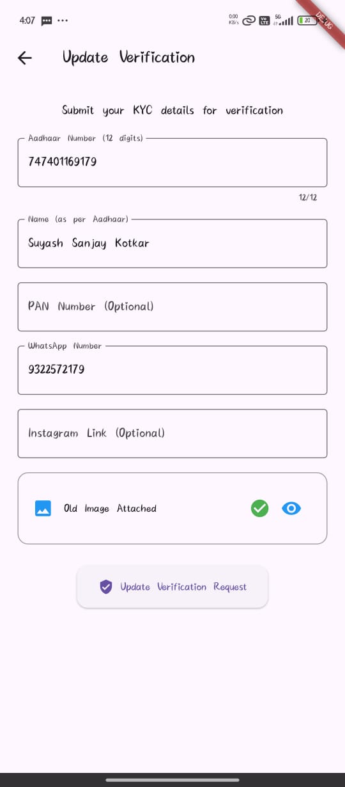
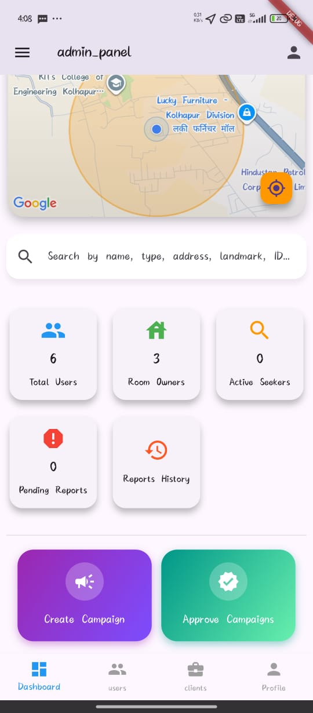
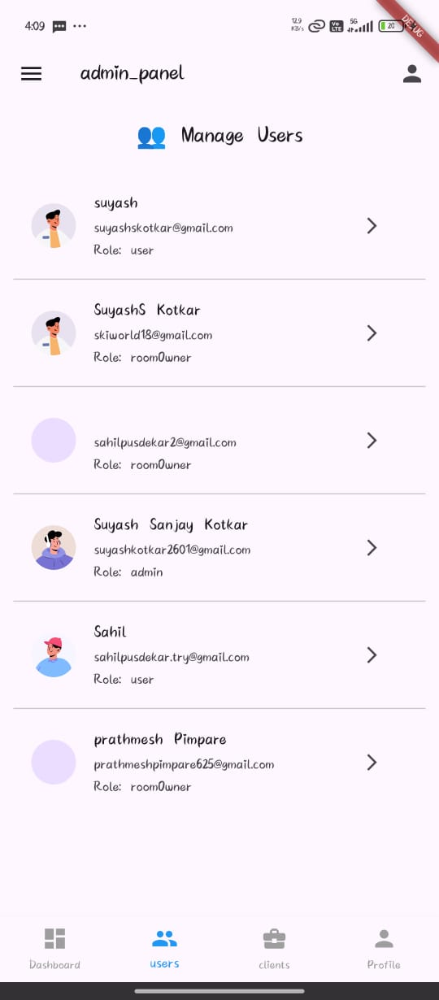
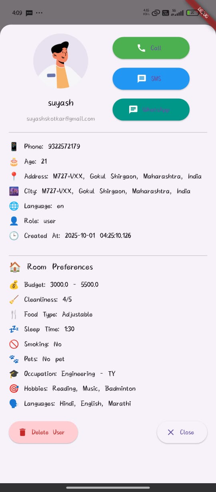
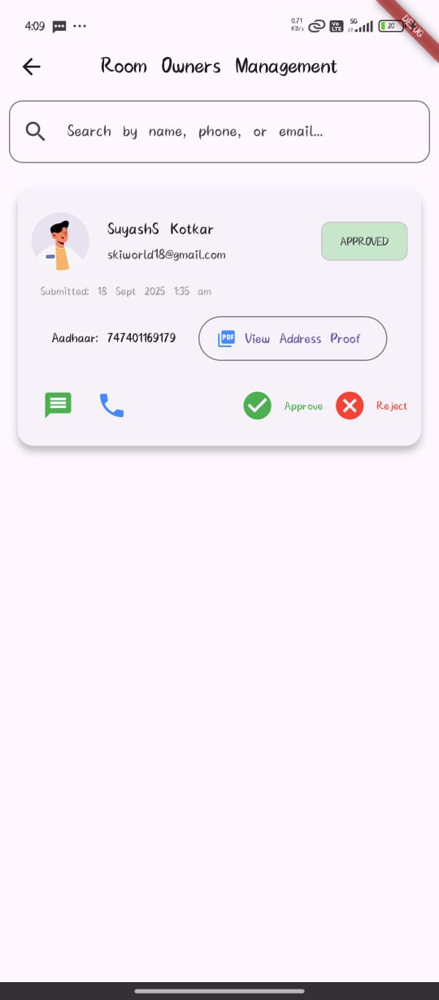
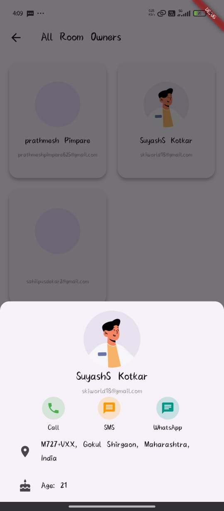
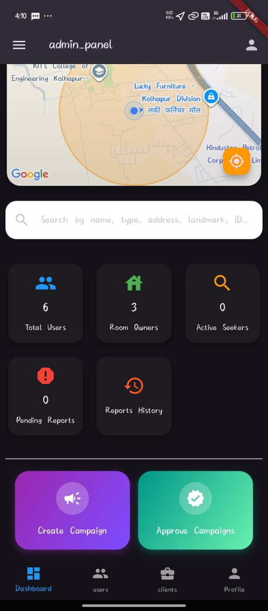
</div>


---

## 📄 License

This project is licensed under the MIT License – see the [LICENSE.md](LICENSE.md) file for details.

---

## 🤝 Contributing

We welcome contributions to enhance the Roomie app. To contribute:

1. Fork the repository.

2. Create a new branch (`git checkout -b feature/your-feature`).

3. Make your changes and commit them (`git commit -am 'Add new feature'`).

4. Push to the branch (`git push origin feature/your-feature`).

5. Create a new Pull Request.

Please ensure your code adheres to the project's coding standards and includes appropriate tests.

---

## 🧑‍💻 Contributors

* **Suyash S Kotkar** – *Lead Developer*

<!-- * **Suyash Kotkar** – *UI/UX Designer* -->
* **Prathmesh P** – *Lead Developer*

* **Sahil P** – *Lead Developer*

---
